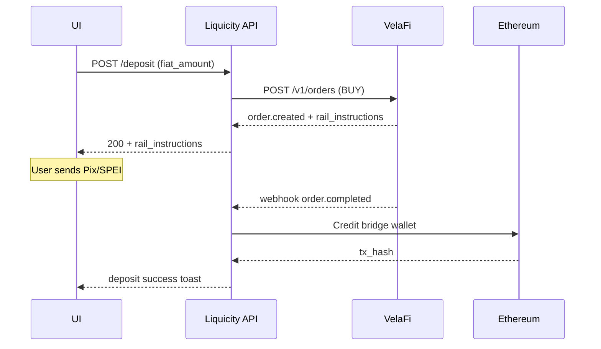
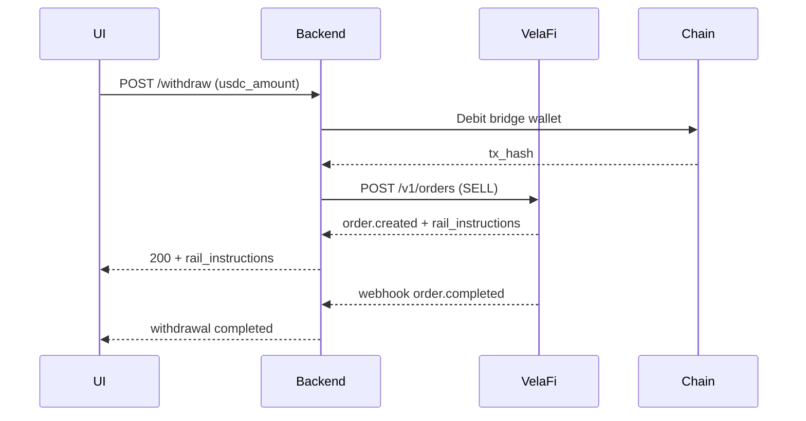

# Product Requirements Document: LATAM On/Off-Ramp via VelaFi

## 1. Introduction / Overview
Liquicity currently supports ACH (US) and SEPA (EU) on-ramps through Plaid + Bridge virtual accounts.  We now want to extend coverage to Latin-America (LATAM) by integrating the VelaFi platform.  VelaFi abstracts local payment rails (Pix, SPEI, CBU, etc.), FX conversion, USDC minting and settlement.  The new flow should be invisible to the user—after their KYC country is detected as LATAM, deposits/withdrawals will re-use the *existing* Deposit / Withdraw UI but route through VelaFi under the hood.

## 2. Goals (SMART)
1. Enable LATAM residents (Brazil, Mexico, Argentina & future markets) to buy/sell USDC within Liquicity. ✅
2. ≥ 95 % of successful LATAM deposits settle ≤ 5 minutes from local-fiat receipt (incl. mint & on-chain transfer). ⏱️
3. Zero manual ops for reconciliation—webhook + polling must auto-update order state. 🛠️
4. 100 % of LATAM volume tracked in analytics dashboard with breakdown by country & rail. 📊

## 3. User Stories
1. **As a LATAM user** (🇧🇷/🇲🇽/🇦🇷 …), **I want** to deposit local fiat via Pix/SPEI/CBU **so that** I instantly receive USDC in my Liquicity wallet.
2. **As a LATAM user**, **I want** to withdraw USDC to my bank account **so that** I receive local fiat in my local currency at a transparent FX rate.
3. **As Compliance**, **I want** VelaFi’s KYC decision & documents saved in our DB **so that** audits & SARs are covered.
4. **As Finance**, **I want** every VelaFi order’s status and USD value logged **so that** treasury sweeps & yield allocation are correct.
5. **As Support**, **I want** to view order state & failure reasons **so that** I can quickly resolve user tickets.

## 4. Functional Requirements
### 4.1 Eligibility & KYC
FR-1  The system shall route users whose ISO-3166 country ∈ {BR, MX, AR …} to the `RegionalKycService.LATAM` branch.
FR-2  The backend shall create VelaFi customers via `VelafiClient.create_customer` after internal profile creation.
FR-3  The backend shall upload KYC documents to `/v1/customers/{id}/documents` and persist the returned IDs.
FR-4  Webhook `velafi.kyc.status.changed` shall update `UserProfile.kyc_status` and persist risk flags.
FR-5  If KYC tier required by VelaFi > tier provided, UI must prompt the user for additional docs (re-use existing manual-KYC modal).

### 4.2 Deposit (On-Ramp)
FR-6  When a LATAM user selects *Deposit*, the UI shall call `GET /v1/quote` (optional) and display FX rate & fees.
FR-7  On confirmation, backend shall `POST /v1/orders` (fiat_amount, fiat_currency, wallet_address, idempotency_key).
FR-8  Response fields `rail_instructions` (Pix key, CLABE, etc.) shall render in the deposit-success screen.
FR-9  Webhook `order.completed` shall credit net USDC to the user’s *custodial bridge wallet* via `Bridge.credit_wallet`.
FR-10  Webhook `order.failed` shall mark deposit as failed and surface reason in UI.
FR-11  `velafi_monitor.py` shall poll any `processing` orders > 10 min old and reconcile status.

### 4.3 Withdrawal (Off-Ramp)
FR-12  UI shall re-use *Withdraw* screen; if user country is LATAM, backend creates a VelaFi **sell** `POST /v1/orders` with `direction=SELL`.
FR-13  Rail instructions (e.g., Pix refund key) returned in response shall display as confirmation.
FR-14  Webhook `order.completed` shall debit USDC from custodial wallet and mark payout done.

### 4.4 Data & Analytics
FR-15  Store VelaFi order data in `VelafiOrder` table (id, user_id, fiat_amount, fiat_currency, fx_rate, fees, rail, status, tx_hash).
FR-16  Daily cron exports LATAM volume to BI pipeline.
FR-17  API `/admin/velafi/orders` returns paginated list with filters (country, rail, status).

### 4.5 Treasury & Yield Pool
FR-18  Idle LATAM USDC balances shall be included in existing Treasury sweep job unchanged.

## 5. Non-Goals / Out of Scope
NG-1  Card on-ramp (Mastercard, Visa).
NG-2  In-app FX swapping between non-USD stablecoins.
NG-3  Support for non-LATAM countries in this phase.
NG-4  Crypto-to-crypto swaps.

## 6. Design Considerations
* Re-use current Deposit / Withdraw React components (`pages/wallet/deposit.tsx`, `withdraw.tsx`).
* When `countryGroup===LATAM`, show a **rail instructions** component instead of Plaid link.
* Add country-specific disclaimers/fees via i18n JSON.
* Mobile-first layout unchanged.

## 7. Technical Considerations
* **Monolith vs. Microservice:** Prefer extending the existing `clean_backend` FastAPI app with a `routers/velafi_kyc.py` & `routers/velafi_payment_method.py` (already stubbed).  A separate micro-service would add infra overhead; revisit if latency or compliance isolation becomes critical.
* **Region Gating:** `RegionalKycService.get_kyc_system_for_country()` already returns `"velafi"` for LATAM codes—verify list is up-to-date.
* **Security:** Re-use current HMAC validation util for VelaFi webhooks.  Rate-limit create_order to prevent quote-spam.
* **Idempotency:** All create_order calls must set an idempotency key (user_id + epoch_ms) and enforce unique constraint in DB.

## 8. Success Metrics
1. ≥ 90 % of LATAM deposits settled ≤ 5 min (P95).
2. ≤ 1 % webhook failure rate (fallback polling).
3. Support tickets tagged *LATAM deposit* < 2 % of total LATAM TXs by week 4.
4. Revenue from FX spread & dev fee ≥ $X / month (to be finalised by Finance).

## 9. Open Questions
1. Should we display *live* FX quote refresh every 15 s or lock on first render?  Impact on API quota.
2. Treasury fee vs. developer fee breakdown—who sets percentages?  Config file vs. DB.
3. Do we need off-ramp limits per country (e.g., BRL 50 K / day) surfaced to UI?
4. Any local tax obligations (IOF in Brazil) requiring in-app disclosure?
5. Future expansion: adding Chile & Colombia—should we parametrize rail enums now?

---

## 10. Implementation Roadmap & Timeline

| Phase | Sprint (wk) | Key Deliverables |
|-------|-------------|------------------|
| Foundations | 1–2 | Secrets in vault, config flags, Alembic migration for `velafi_order`, `UserProfile` columns |
| Backend APIs | 2–4 | `VelafiService`, KYC + Orders routers, webhook handlers, cron monitor |
| Front-End | 4–5 | Deposit / Withdraw LATAM variant, rail-instruction component, i18n copy |
| QA & Launch | 6 | E2E tests green, alerts in Grafana, feature flag enable for 🇧🇷 & 🇲🇽 |

### Critical Path Tasks (number → task-id from internal tracker)
1. velafi_backend_models (DB migration)
2. velafi_backend_services (API wrappers)
3. velafi_backend_routers (FastAPI endpoints & webhooks)
4. velafi_frontend_ui (React updates)
5. velafi_monitor (cron job)
6. velafi_tests (unit + integration)
7. velafi_ops (secrets, alerting)

Dependency graph: 1 → 2 → 3/5 → 4 → 6 → 7.

## 11. API Contracts

### 11.1 Webhooks (from VelaFi)
| Event | Sample Fields | Action |
|-------|--------------|--------|
| `velafi.kyc.status.changed` | customer_id, status, reason_code | Update `UserProfile.latam_kyc_status`; if `rejected` surface UI message |
| `order.completed` | order_id, fiat_amount, fiat_currency, usdc_amount, tx_hash | Credit bridge wallet & mark `VelafiOrder.status=completed` |
| `order.failed` | order_id, failure_code, detail | Mark failed; UI toast; optionally auto-refund |

### 11.2 Internal Endpoints (Liquicity → VelaFi)
| Method | Path | Req Body | Resp | Notes |
|--------|------|----------|------|-------|
| POST | `/velafi/kyc/start` | { first_name, last_name, dob, country_code } | { customer_id } | Called after signup |
| POST | `/velafi/kyc/documents` | multipart form | 202 | Pass-through to VelaFi docs API |
| GET | `/velafi/kyc/status` | query `customer_id` | { status } | UI polling fallback |
| POST | `/velafi/orders` | { direction, fiat_amount, fiat_currency, wallet_address } | { order_id, rail_instructions } | direction=BUY or SELL |

## 12. Risks & Mitigations
1. **Webhook loss** → Polling job every 5 min & DLQ retry middleware.
2. **FX rate fluctuation > quote lock** → Quotes valid for 30 min; user must re-confirm after expiry.
3. **Regulatory changes per country** → Country list & limits in config table for hot-edit w/o deploy.
4. **On-chain congestion delaying USDC tx** → Surface pending status + EIP-1559 fee bump logic fallback.

---
## 13. Database Schema (DDL)

```sql
-- velafi_order table
CREATE TABLE velafi_order (
    id             BIGSERIAL PRIMARY KEY,
    order_id       VARCHAR(64) UNIQUE NOT NULL,
    user_id        BIGINT      REFERENCES users(id) ON DELETE CASCADE,
    direction      VARCHAR(4)  CHECK (direction IN ('BUY','SELL')),
    fiat_amount    NUMERIC(18,2) NOT NULL,
    fiat_currency  CHAR(3) NOT NULL,
    usdc_amount    NUMERIC(18,2),
    fx_rate        NUMERIC(18,6),
    fee_usd        NUMERIC(18,2),
    rail           VARCHAR(16),
    status         VARCHAR(16) NOT NULL,
    tx_hash        VARCHAR(66),
    created_at     TIMESTAMPTZ DEFAULT now(),
    updated_at     TIMESTAMPTZ DEFAULT now()
);
CREATE INDEX idx_velafi_order_user ON velafi_order(user_id);
CREATE INDEX idx_velafi_order_status ON velafi_order(status);

-- user_profile additions
ALTER TABLE user_profile ADD COLUMN velafi_customer_id VARCHAR(64);
ALTER TABLE user_profile ADD COLUMN latam_kyc_status VARCHAR(16);
```

## 14. Sequence Diagrams

### 14.1 Deposit (BUY) Flow


### 14.2 Withdrawal (SELL) Flow


## 15. Localization & Copy
* Spanish (es) and Portuguese (pt-BR) translations for all user-visible strings.
* Disclaimers per country stored in table local_disclaimer(country_code, markdown_text).
* Front-end loads latest disclaimer via `/public/config/disclaimer.json` at runtime.

## 16. Performance & Scaling
1. VelafiService uses async HTTP client with 3 s timeout and exponential backoff (max 3 retries).
2. Webhook handler idempotent by order_id to allow at-least-once delivery.
3. Rate-limit user deposit attempts to 5 per minute (per IP + user_id).
4. Polling job shards by modulo(order_id, N) to scale horizontally via Kubernetes CronJobs.

## 17. Audit & Logging
* Log lifecycle transitions at INFO level; redact PII fields in DEBUG logs.
* Persist raw webhook payloads 90 days in encrypted S3 (SSE-KMS), partitioned by date.
* Kibana dashboard filter service:velafi for quick triage.

## 18. Compliance & Regulatory
* Apply FATF travel rule for transfers > USD 1 000; include originator / beneficiary data in on-chain memo when network supports.
* Support GDPR/CCPA erasure via cascade delete on user in velafi_order and redaction of KYC docs.
* VelaFi handles local tax filings; Liquicity must display IOF tax for Brazil in receipt.

## 19. Future Expansion
* Rail enum extensible via config so new rails (TEF-CL, PSE-CO) can be onboarded without code deploy.
* Multi-stablecoin support (USDT, PYUSD) behind feature flag `enable_multi_stable`.
* If throughput exceeds 50 req/s sustained, evaluate splitting Velafi integration into dedicated micro-service.

## 20. Glossary
| Term | Meaning |
|------|---------|
| Rail | Local payment network (Pix, SPEI, CBU) |
| BUY  | User deposits fiat → receives USDC |
| SELL | User withdraws USDC → receives fiat |
| Bridge Wallet | Liquidity wallet holding user funds on-chain |
| VelaFi | Third-party LATAM payments & FX provider |

---
*Document updated 2025-08-07 rev2.*